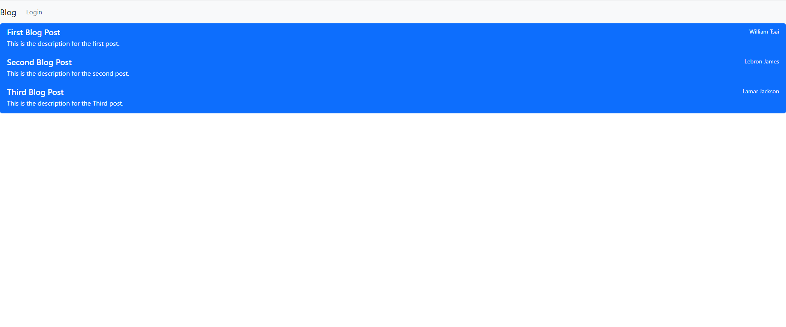

# tech-blog

## Description 

The motivation behind the tech blog project was to provide developers with a user-friendly CMS-style blog site to publish, interact, and engage with each other's articles and opinions.

By following the Model-View-Controller (MVC) paradigm and incorporating technologies such as Handlebars for templating, Sequelize as the ORM, and express-session for authentication, the project delivers a secure, organized, and feature-rich environment for developers to share their insights and connect with the tech community.

Through this project, I learned about the intricacies of building a CMS-style blog site from scratch. The MVC architecture provided a clear and maintainable structure, while technologies like Handlebars.js and Sequelize facilitated efficient data rendering and database management. Additionally, handling user sessions and implementing features such as comments and user dashboards highlighted the importance of user engagement and interactivity in blog platforms. Overall, the project deepened my knowledge of web development.

## Heroku URL

[Tech Blog on Heroku](https://tech-blog-wt-7e409f5b1ee6.herokuapp.com/)

## Installation

Installed the modules with npm i. Must also make sure that mysql2, sequelize, express-session, express-handlebars, dotenv, connect-session-sequelize, and bcrypt modules are installed. 

Run mysql -u root to access the mysql interface and then source the schema. Run npm run seed to add the seeds and then run npm start to get the program running.

## Usage

The following image shows the web application's appearance and functionality:

## Credits

N/A

## License

N/A